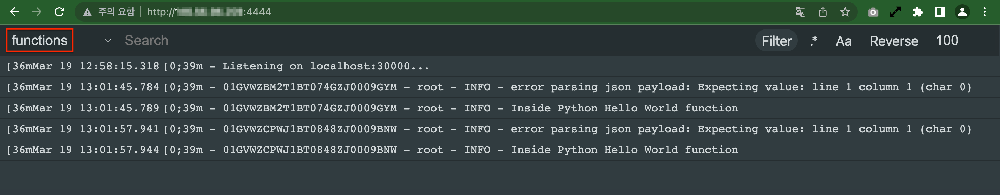

# fn-log-web-tail

## Used tools

### Simple Serverless Logging For Oracle Functions
- https://blogs.oracle.com/developers/post/simple-serverless-logging-for-oracle-functions
- [simple-socket-fn-logger](https://github.com/recursivecodes/simple-socket-fn-logger)

### Web UI for viewing logs
- [log-viewer](https://github.com/sevdokimov/log-viewer)

### Supervisor: A Process Control System
Used to launch two process in single container.
- http://supervisord.org/

## How to use

1. Generate a password in MD5 format for the viewer user. If the password is 2,

   ```
   $ md5 -s "2"
   c81e728d9d4c2f636f067f89cc14862c
   ```

2. Launch container using OCI Container Instance

   - Container image

      * Registry hostname: `ghcr.io`
      * Repository: `thekoguryo/fn-log-web-tail`
      * Tag: `1.1`
      * Registry credentials type: `None`

   - Environmental variables

      * Key: `PASSWORD_MD5`
      * Value: ex, `c81e728d9d4c2f636f067f89cc14862c`
      * Container Instances once created are not mutable. To change the environment variables, you would need to recreate the CI


3. Open two ports(8881, 30000) in your security list of the container instance.

4. Update syslog-url of your OCI Function App

   ```
   fn update app oci-hol-fn-app --syslog-url tcp://<container-intance-ip>:30000
   ```

5. If you enable oci logging in your fn app, disable it.

6. Invoke your function - hello-python function

   ```fn invoke [app-name] [function-name]```

   ```
   fn invoke oci-hol-fn-app hello-python
   ```

6. You can see your function log without any delay in your container instance.

   - http://`<container-intance-ip>`:8111/log?log=functions

   - Login as `viewer` username
   
   - OCI Functions log in fn-log-web-tail

   
