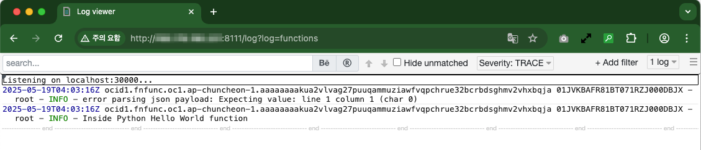

# fn-log-web-tail

## Used tools

### Simple Serverless Logging For Oracle Functions
- https://blogs.oracle.com/developers/post/simple-serverless-logging-for-oracle-functions
- [simple-socket-fn-logger](https://github.com/recursivecodes/simple-socket-fn-logger)

### Web-Based Tail
- [Web tail](https://github.com/mishankov/web-tail)

### Supervisor: A Process Control System
Used to launch two process in single container.
- http://supervisord.org/

## How to use

1. Build a image and push to your image registry(ex, OCIR)

   ```
   docker build -t fn-log-web-tail:1.0 .
   docker tag fn-log-web-tail:1.0 <region-key>.ocir.io/<tenacy-namespace>/fn-log-web-tail:1.0
   ```

2. Launch container using OCI Container Instance

3. Open two ports(4444, 30000) in your security list of the container instance.

4. Update syslog-url of your OCI Function App

   ```
   fn update app oci-hol-fn-app --syslog-url tcp://<container-intance-ip>:30000
   ```

5. If you enable oci logging in your fn app, disable it.

6. Invoke your function - hello-python function

   ```fn invoke [app-name] [function-name]```

   ```
   fn invoke oci-hol-fn-app hello-python
   ```

6. You can see your function log without any delay in your container instance.

   - http://`<container-intance-ip>`:4444
   
   - Select **functions** as a source

   
